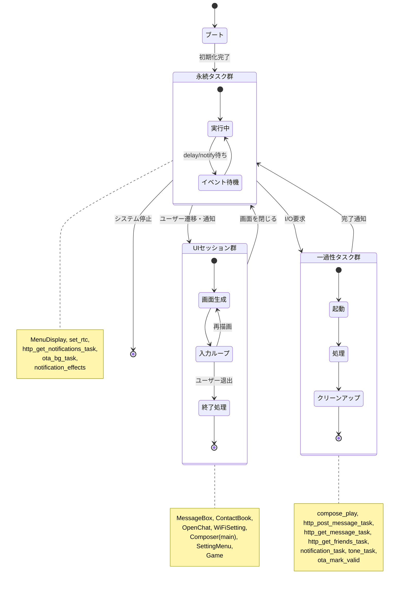

# タスクライフサイクル調査

## 調査サマリ

- FreeRTOSタスクの生成箇所を横断的に確認し、起動契機・ライフサイクル・資源消費を整理した。
- スタックサイズは`words`（4バイト単位）指定のため、概算バイトを併記した。
- 常駐タスク（メニュー/UI基盤、RTC、通知監視など）が100KB超の内部RAMを常時占有しており、UI系タスクの同時起動時にピークが高くなる。

## タスク一覧

| タスク名 | 定義位置 | 起動契機 | スタック/優先度/コア | 主な挙動 |
| --- | --- | --- | --- | --- |
| `ota_mark_valid` | `main/main.cpp:764` | ブート時に遅延OTA検証 | 4096 words ≒ 16KB / prio5 / 任意 | 8秒待機→OTA状態確認→必要に応じWi-Fi停止/再開→`vTaskDelete` |
| `notification_effects::task_body` | `components/Notiff/src/notification_effects.cpp:42` | `notification_effects::init()` or `signal_new_message()` | 4096 words ≒ 16KB / prio6 / 任意 | 通知待機→ハプティクス＋LED演出→常駐 |
| `check_notification_task` | `components/Notiff/include/notification.hpp:70` | `Notification::check_notification()`（現状未使用） | 4096 words ≒ 16KB / prio5 / core0 | `notif_flag`ポーリング→3秒周期ディレイ→常駐 |
| `notification_task` | 同上:84 | `Notification::recv_notification()` | 4096 words ≒ 16KB / prio20 / core0 | サウンド＋OLED表示→完了後`notify_task_handle=nullptr`→`vTaskDelete` |
| `http_post_message_task` | `components/Network/include/http_client.hpp:482` | `HttpClient::post_message()` | 8192 words ≒ 32KB / prio5 / core1 | チャット送信→APIフォールバック→`vTaskDelete` |
| `http_get_message_task` | 同:233 | `HttpClient::get_message()` | 6192 words ≒ 25KB / prio5 / 任意 | API認証→メッセージ取得→結果格納→`vTaskDelete` |
| `http_get_friends_task` | 同:345 | `HttpClient::fetch_friends_blocking()` | 6144 words ≒ 25KB / prio5 / 任意 | 友だち一覧取得→待機タスクへNotify→`vTaskDelete` |
| `http_get_notifications_task` | 同:377 | `HttpClient::start_notifications()` | 6000 words ≒ 24KB / prio5 / core0 | Wi-Fi待機→MQTT購読→通知発火→常駐 |
| `set_rtc` | `components/Network/include/ntp.hpp:60` | `start_rtc_task()` | 4048 words ≒ 16KB / prio6 / core0 | Wi-Fiイベント待機→SNTP同期→1分周期更新 |
| `ota_bg_task` | `components/Upgrade/ota_client.cpp:336` | `ota_client::start_background_task()` | 8192 words ≒ 32KB / prio5 / core0 | `ota_auto`確認→OTA実行→6時間周期ループ |
| `Max98357A::tone_task_main` | `components/Audio/include/max98357a.hpp:447` | `Max98357A::start_tone()` | 2048 words ≒ 8KB / prio5 / core1 | DMAバッファで連続トーン→停止処理→`vTaskDelete(self)` |
| `MessageBox::box_task` | `components/Display/include/oled.hpp:917` | `MessageBox::start_box_task()` | 9216 words ≒ 37KB / prio6 / core1 | メッセージUI→終了時にフラグ/HW解放→`vTaskDelete` |
| `ContactBook::message_menue_task` | 同:1544 | `ContactBook::start_message_menue_task()` | 4096 words ≒ 16KB / prio6 / core1 | 連絡先UI＋WDT管理→終了で`vTaskDelete` |
| `OpenChat::open_chat_task` | 同:2803 | `OpenChat::start_open_chat_task()` | 9216 words ≒ 37KB / prio6 / core1 | MQTT常時受信UI→退出で`vTaskDelete` |
| `WiFiSetting::wifi_setting_task` | 同:2829 | `WiFiSetting::start_wifi_setting_task()` | 8096 words ≒ 32KB / prio6 / core1 | APスキャンUI→終了でハンドル解放 |
| `Composer::composer_task` | 同:3631 | `Composer::start_composer_task()` | 16384 words ≒ 64KB / prio6 / core1 | 作曲UI→再生サブタスク管理→終了時`vTaskDelete` |
| `compose_play` | 同:4314 | `Composer::composer_task()`内で再生要求時 | 4096 words ≒ 16KB / prio5 / core1 | PCM生成し再生→完了後`Composer::s_play_task=nullptr`→`vTaskDelete` |
| `SettingMenu::message_menue_task` | 同:4380 | `SettingMenu::start_message_menue_task()` | 6192 words ≒ 25KB / prio6 / core1 | 設定UI→選択に応じ他タスク起動→終了で`vTaskDelete` |
| `Game::game_task` | 同:5331 | `Game::start_game_task()` | 14288 words ≒ 87KB / prio6 / core1 | ゲーム選択/実行→WDT監視→終了で`vTaskDelete` |
| `MenuDisplay::menu_task` | 同:5951 | `MenuDisplay::start_menu_task()` | 4288 words ≒ 48KB / prio6 / core0 | メインメニュー常駐→各UIタスク起動 |

## 状態遷移概要

## 備考

- `components/Notiff/include/notification.hpp`内タスクは旧実装で現状未使用。復活させる場合は同時実行数やWDTの扱いを再確認する。
- 常駐系（`set_rtc`、`http_get_notifications_task` 等）だけで内部RAM消費が大きく、UIタスクが最大全開になるとピークが200KB超に達する。スタックハイウォータマークのログを活用し、削減できるタスクから順次調整するのが有効。
- OTA関連はワンショットの`ota_mark_valid`と常駐の`ota_bg_task`の2種がある。ファーム更新ポリシーを見直す際は両方を意識すること。
