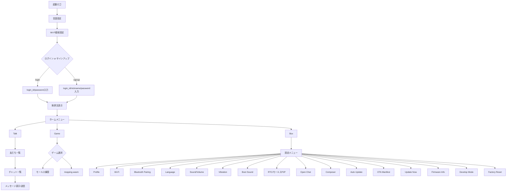

# 画面フロー

## テキストベース

### 初期設定時

- ※2-4の区間はback buttonで戻れるようにする

1. 起動ロゴ
2. 言語設定(日本語 or English)
3. Wi-Fi接続設定
4. ログイン選択画面(login or signup)
5. 挨拶文表示
6. ホーム画面

#### ログイン選択画面の詳細

- login
  - login_id と password を入力してログイン
- signup
  - login_id / nickname / password を入力して登録

### 通常時(ホーム画面以降)

- ホームメニュー(Talk / Box / Game)
  - Talk -> 友だち一覧 -> チャット一覧 -> メッセージ表示/送信(モールス入力)
  - Box -> 設定メニュー
  - Game -> ゲーム選択(モールス練習 / mopping.wasm)

#### 設定メニュー(主要項目)

- Profile
- Wi-Fi
- Bluetooth Pairing
- Language
- Sound/Volume
- Vibration
- Boot Sound
- RTC/モールスP2P
- Open Chat(MQTT)
- Composer
- Auto Update
- OTA Manifest
- Update Now
- Firmware Info
- Develop Mode
- Factory Reset

## Mermaid

